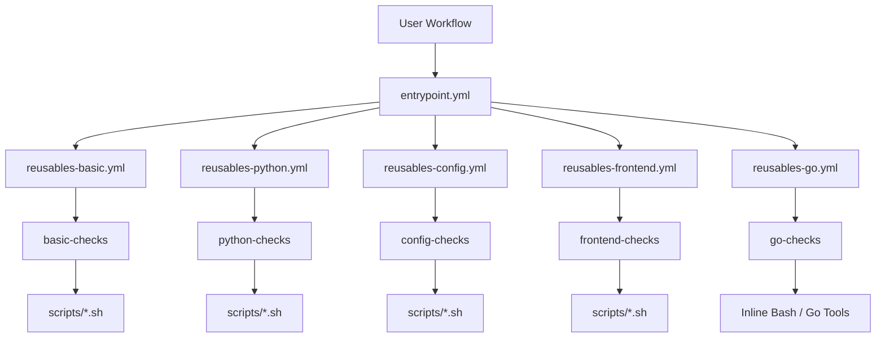
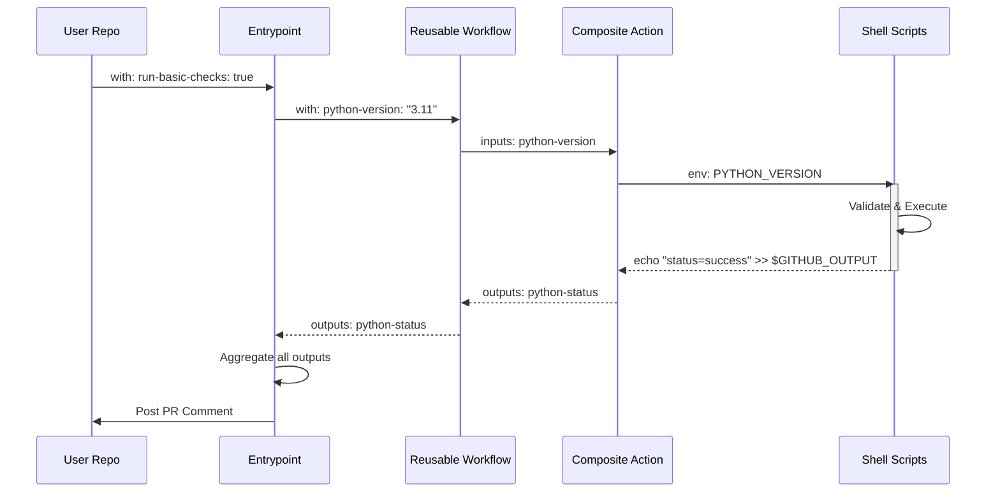

# Sessatakuma Quality Checking Workflows

此儲存庫提供 Sessatakuma 組織共用的 GitHub Actions 工作流程。透過集中管理的「品質閘門 (Quality Gate)」，確保所有專案的程式碼品質與風格一致。

## 🚀 快速開始 (Quick Start)

要在您的儲存庫中使用這些檢查，請建立 `.github/workflows/quality-checks.yml` 檔案並貼上以下內容：

```yaml
name: PR Quality Checks

on:  # yamllint disable-line rule:truthy
  pull_request:
    branches: ['main']
    types: [opened, synchronize, reopened, edited]

permissions:
  contents: read
  pull-requests: write
  issues: write
  checks: write

jobs:
  quality-checks:
    name: Run Organization Quality Checks
    uses: sessatakuma/org-workflows/.github/workflows/entrypoint.yml@main
    secrets:
      CHECKER_TOKEN: ${{ secrets.GITHUB_TOKEN }}
    with:
      # Basic PR Quality Checks (enabled by default)
      run-basic-checks: true

      # Python Code Quality Checks (optional)
      # Requires: pyproject.toml with ruff and mypy configured
      run-python-checks: false
      python-version: '3.11'

      # Configuration Files Quality Checks (optional)
      # Checks YAML, JSON, and TOML files for syntax errors
      run-config-checks: true

      # Frontend Code Quality Checks (optional)
      # Requires: Node.js project with Prettier configured
      run-frontend-checks: false
      
      # Go Code Quality Checks (optional)
      # Requires: Go project with go.mod file (golangci-lint config optional)
      # Checks: go mod tidy, golangci-lint, tests (race detector), build
      run-go-checks: false
      go-version: 'stable'
      golangci-lint-version: 'latest'
```

就是這樣！您的 PR 現在會自動執行這些檢查並在留言中回報結果。

---

## ⚙️ 參數設定 (Configuration)

### 1. 輸入參數 (Inputs)

您可以透過 `with` 區塊調整檢查行為：

| 參數 (Input) | 類型 | 說明 | 預設值 |
| :--- | :--- | :--- | :--- |
| `run-basic-checks` | `boolean` | 檢查 PR 標題、分支命名、Commit 訊息格式與衝突。 | `true` |
| `run-python-checks` | `boolean` | 是否執行 Python 品質檢查 (Ruff, Mypy)。 | `false` |
| `python-version` | `string` | 使用的 Python 版本。 | `'3.11'` |
| `run-frontend-checks` | `boolean` | 是否執行前端品質檢查 (Prettier, ESLint)。 | `false` |
| `run-go-checks` | `boolean` | 是否執行 Go 品質檢查 (Lint, Test, Build)。 | `false` |
| `go-version` | `string` | 使用的 Go 版本 (例如 `1.21` 或 `stable`)。 | `'stable'` |
| `golangci-lint-version` | `string` | 使用的 golangci-lint 版本。 | `'latest'` |
| `go-working-directory` | `string` | Go 專案的工作目錄 (若不在根目錄時使用)。 | `'.'` |
| `run-config-checks` | `boolean` | 是否驗證 YAML, JSON, TOML 檔案語法。 | `false` |

### 2. 機密資訊 (Secrets)

| 名稱 (Secret) | 是否必填 | 說明 |
| :--- | :--- | :--- |
| `CHECKER_TOKEN` | **是** | 請傳入 `${{ secrets.GITHUB_TOKEN }}` 以供機器人發表 PR 留言。 |

---

## 🔍 檢查項目詳情

### 1. Basic Checks (基本檢查)
*   **PR Title**: 必須符合 Conventional Commits (例如 `feat: add new login page`)。
*   **Branch Name**: 必須包含類別前綴 (例如 `feature/`, `bugfix/`, `hotfix/`)。
*   **Merge Conflicts**: 檢查是否包含未解決的衝突標記 (`<<<<<<<`)。

### 2. Python Checks
*   使用 `uv` 與 `ruff` 進行極速 Linting 與 Formatting。
*   使用 `mypy` 進行靜態型別檢查。
*   *Feature*: 若您的專案沒有 `pyproject.toml`，會自動注入預設配置。

### 3. Frontend Checks
*   **Prettier**: 程式碼格式化。
*   **ESLint**: JavaScript/TypeScript 語法檢查。
*   *Feature*: 支援自動注入預設的 `.prettierrc` 與 `eslint.config.mjs`。

### 4. Go Checks
*   **Go Mod**: 檢查 `go.mod` 與 `go.sum` 是否同步。
*   **GolangCI-Lint**: 靜態分析。
*   **Race Detector**: 使用 `-race` 執行測試。

---

## 🔧 新增或修改工作流程 (Adding or Modifying Workflows)

如果您想要新增或修改檢查工作流程，請參考 **[如何新增工作流程 (How to Add Workflows)](./HOW_TO_ADD_WORKFLOWS.md)** 設計指南，了解完整的架構設計、實作步驟與命名慣例。

---

## 🏗️ 架構概覽 (Architecture Overview)

本專案採用分層架構設計，以確保靈活性與可維護性：



### 🔄 資料流向 (Data Flow)

以下時序圖展示了參數如何向下傳遞成為環境變數，以及執行結果如何向上回報：



---

## 💻 本地模擬測試 (Local Testing)

在將程式碼推送到 GitHub 之前，您可以使用 [act](https://github.com/nektos/act) 在本機電腦上模擬執行這些檢查。這能幫助您快速修復錯誤，無需等待 CI 排隊。

**先決條件**：需安裝 Docker, `act` 與 `yamllint`。

```bash
# 1. 驗證 YAML 語法 (強烈建議)
yamllint .github/

# 2. 在您的專案根目錄列出可用的 Actions
act pull_request --list

# 3. 模擬執行 Pull Request 事件 (執行所有檢查)
act pull_request

# 4. Dry run (檢查流程結構但不實際執行)
act pull_request -n
```

> **注意**：由於 `act` 是模擬環境，某些 GitHub 特有功能（如 OIDC 或快取）可能無法完全運作，但對於驗證程式碼品質檢查通常已足夠。
